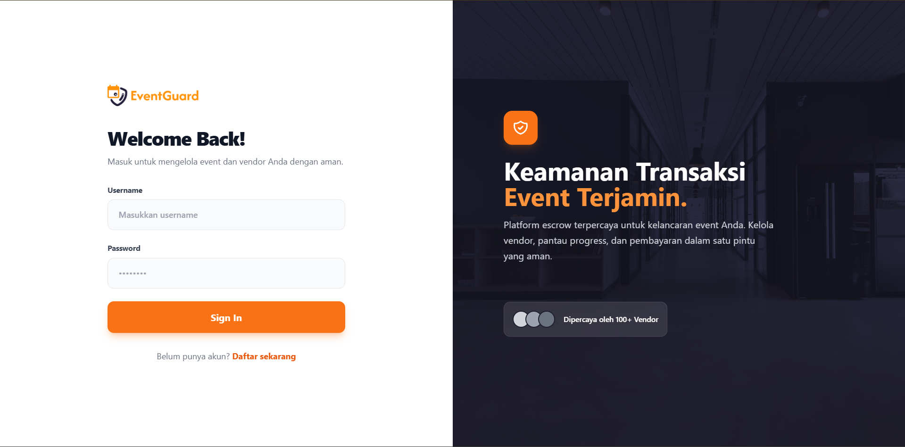

# EventGuard



**EventGuard** is a trusted escrow platform for event management that connects clients with professional vendors. The platform provides secure payment systems, digital documents (MoU), and project progress tracking in one integrated ecosystem. This project is a **prototype** built for final project of **II3120 - Information Systems and Technology Services**.


## 🚀 Key Features

### For Clients

- **Verified Vendor Search** - Browse vendors with ratings, portfolios, and reviews
- **Project Brief Builder** - Comprehensive form to describe event requirements
- **Real-time Negotiation** - Direct chat with vendors for proposal revisions
- **Digital MoU** - Legal contracts that can be signed digitally
- **Escrow Payment** - Funds secured until milestones are achieved
- **Dashboard Tracking** - Monitor project status from brief to completion

### For Vendors

- **Profile Showcase** - Display portfolio, service packages, and ratings
- **Proposal System** - Send and revise offers easily
- **Project Management** - Manage multiple projects in one dashboard
- **Secure Payment** - Receive staged payments according to terms


## 🏗️ Technology Stack

### Backend

- **Framework**: FastAPI (Python)
- **Database**: SQLite
- **ORM**: SQLAlchemy
- **Authentication**: Token-based auth
- **API Documentation**: Swagger UI (FastAPI built-in)

### Frontend

- **Framework**: React & Vite
- **Routing**: React Router v6
- **Styling**: TailwindCSS
- **HTTP Client**: Axios
- **PDF Generation**: html2pdf.js
- **State Management**: Context API


## 📁 Project Structure

```
eventguard/
├── backend/
│   ├── app/
│   │   ├── db/
│   │   │   ├── database.py      # Database configuration
│   │   │   └── models.py        # SQLAlchemy models (User, Project, Proposal, MoU, Invoice, Message)
│   │   ├── router/
│   │   │   ├── auth_route.py    # Login/register endpoints
│   │   │   ├── vendor_route.py  # Vendor list/detail endpoints
│   │   │   ├── project_route.py # Project CRUD & chat endpoints
│   │   │   └── mou_route.py     # MoU generate & sign endpoints
│   │   ├── schemas/             # Pydantic schemas for validation
│   │   ├── dependencies.py      # Auth middleware
│   │   └── main.py              # FastAPI app entry point
│   ├── static/
│   │   ├── templates/           # MoU PDF templates
│   │   └── uploads/             # File upload storage
│   ├── requirements.txt
│   └── .env
│
├── frontend/
│   ├── src/
│   │   ├── components/
│   │   │   ├── Navbar.jsx
│   │   │   ├── VendorCard.jsx
│   │   │   ├── VendorDetailModal.jsx
│   │   │   ├── ChatBubble.jsx
│   │   │   └── ProtectedRoute.jsx
│   │   ├── pages/
│   │   │   ├── Login.jsx
│   │   │   ├── Dashboard.jsx
│   │   │   ├── VendorSearch.jsx
│   │   │   ├── ProjectBrief.jsx
│   │   │   ├── SignMoU.jsx
│   │   │   └── Profile.jsx
│   │   ├── context/
│   │   │   └── AuthContext.jsx
│   │   ├── api/
│   │   │   ├── client.js
│   │   │   └── endpoints.js
│   │   ├── App.jsx
│   │   └── main.jsx
│   ├── public/
│   │   └── images/              # Vendor profile & header images
│   ├── package.json
│   ├── vite.config.js
│   └── tailwind.config.js
│
└── README.md
```


## 🛠️ Installation & Setup

### Prerequisites

- **Python 3.11+**
- **Node.js 18+**
- **npm** or **yarn**

### 1. Clone Repository

```bash
git clone https://github.com/yourusername/eventguard.git
cd eventguard
```

### 2. Backend Setup

```bash
cd backend

# Install dependencies
pip install -r requirements.txt

# Configure environment (optional)
cp .env.example .env
# Edit .env if custom config needed

# Run server
uvicorn app.main:app --reload
```

**Backend runs at**: `http://localhost:8000`  
**API Docs**: `http://localhost:8000/docs`

### 3. Frontend Setup

```bash
cd frontend

# Install dependencies
npm install

# Configure environment (optional)
cp .env.example .env
# Set VITE_API_URL if backend is not at localhost:8000

# Run dev server
npm run dev
```

**Frontend runs at**: `http://localhost:5173`


## 👥 Default Users (Dummy Data)

### Client

- **Username**: `rina_eo`
- **Password**: `password123`
- **Role**: Client

### Vendor

- **Username**: `sound_bandung`
- **Password**: `password123`
- **Role**: Vendor


## 📖 Usage Flow

### Complete Workflow:

1. **Login** → Client logs into the platform
2. **Search Vendor** → Browse vendors by category/location
3. **Create Brief** → Fill out detailed project requirements form
4. **Vendor Review** → Vendor reviews brief and sends proposal
5. **Negotiation** → Real-time chat for offer revisions
6. **Generate MoU** → Vendor creates digital contract draft
7. **Review & Sign** → Client reviews and signs document
8. **Project Active** → System releases escrow in stages (terms)
9. **Completion** → Project completed, final payment released


## 🔌 API Endpoints (Summary)

### Authentication

- `POST /login` - User login

### Vendors

- `GET /vendors` - List all vendors
- `GET /vendors/{id}` - Vendor details

### Projects

- `POST /projects` - Create new project (client)
- `GET /projects` - List user projects
- `GET /projects/{id}` - Project details
- `POST /projects/{id}/proposals` - Send proposal (vendor)
- `GET /projects/{id}/messages` - Chat history
- `POST /projects/{id}/messages` - Send message

### MoU

- `POST /projects/{id}/mou` - Generate MoU
- `GET /mou/{mou_id}` - MoU details
- `POST /mou/{mou_id}/sign` - Digital signature
- `PATCH /mou/{mou_id}/status` - Approve/Revise MoU

**Full API Documentation**: Access Swagger UI at `http://localhost:8000/docs`


## 🎨 UI/UX Features

- **Modern Design** - TailwindCSS with custom color scheme
- **Responsive** - Mobile-first design approach
- **Real-time Chat** - Auto-refresh every 3 seconds
- **PDF Export** - Download brief & MoU as PDF
- **Progress Tracker** - Visual stepper for project status
- **Avatar Fallback** - UI Avatar API for default profiles


## 🔐 Security Features

- **Token Authentication** - JWT-like token system
- **Role-based Access** - Client, Vendor, Admin separation
- **Escrow Protection** - Funds held until milestones met
- **Digital Signature** - Timestamp & user verification in MoU
- **Input Validation** - Pydantic schemas in backend


## 📝 Development Notes

### Frontend State Management

- **AuthContext** for global user state
- **localStorage** for MoU data persistence
- **React Hooks** (useState, useEffect, useRef)

### Backend Architecture

- **SQLAlchemy ORM** with relationship mapping
- **Pydantic Schemas** for request/response validation
- **FastAPI Dependency Injection** for auth middleware
- **CORS Middleware** to allow frontend access